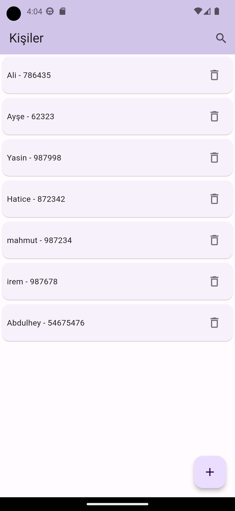
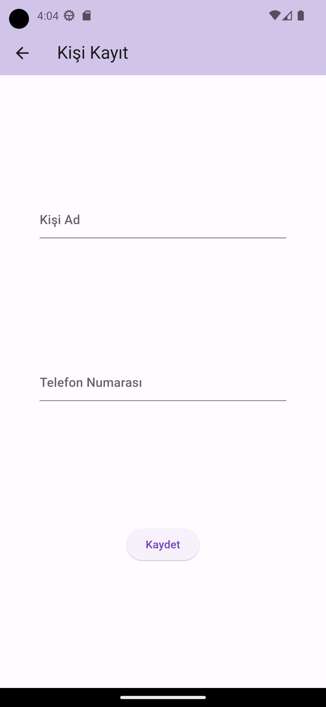
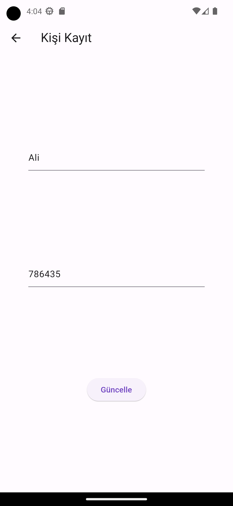

# Bloc Cubit kullanım örneği

Merhaba👋 Bloc pattern ve sqlite kullanarak kişiler uygulamasını yaptım 
### Kullanılan Paketler

``` 
flutter_bloc: ^8.1.3
path: ^1.8.3
sqflite: ^2.3.0
```

### Bazı Görseller

#### Anasayfa Ekran Görüntüsü


#### Kayıt Ol Ekran Görüntüsü


#### Güncelle Ekran Görüntüsü



